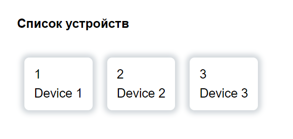
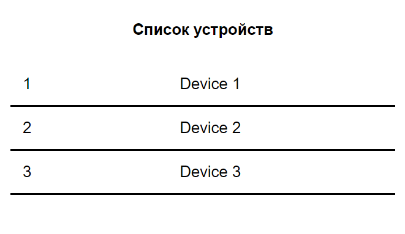
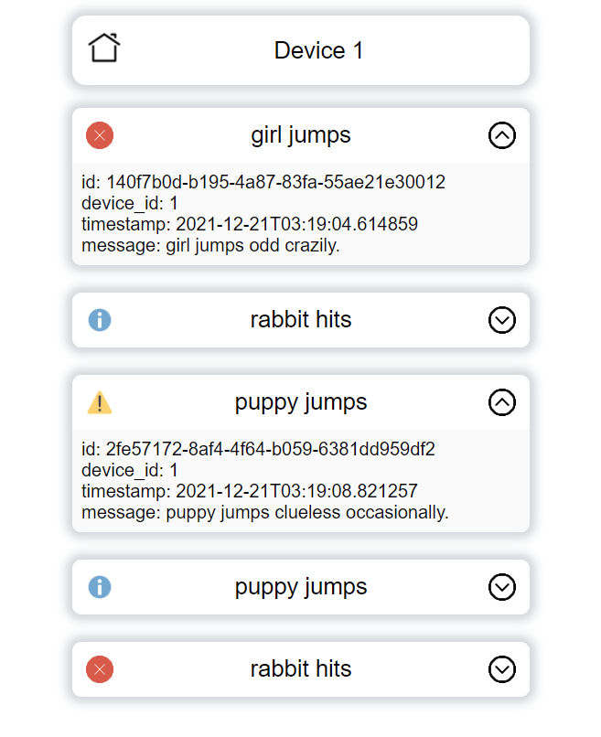

# Тестовое задание для frontend разработчика

## Предварительная настройка

### front

В файле `/app/src/consts.js` лежат адреса бекенда. По умолчанию:

```js
API_URL: 'http://localhost:8000'
WS_API_URL: 'ws://localhost:8000'
```

### back

В `app.py` внесены небольшие изменения: 

настройка CORS:

```python
from fastapi.middleware.cors import CORSMiddleware

app.add_middleware(
    CORSMiddleware,
    allow_origins=["*"],
    allow_credentials=True,
    allow_methods=["*"],
    allow_headers=["*"],
)
```

И ещё

```python
time.sleep(random.random() * 3)
```

исправлено на:

```python
import asyncio
await asyncio.sleep(random.random() * 3)
```

При использовании `time.sleep` бэкенд зависал и не реагировал на запросы. Исправленный файл лежит в корне репозитория, запустить бекенд можно командой

```bash
uvicorn app:app
```

## Запуск

### npm

```bash
cd app
npm install
npm run serve
```

### Docker

```bash
cd app
docker-compose build
docker-compose up
```

## Сам фронтенд



